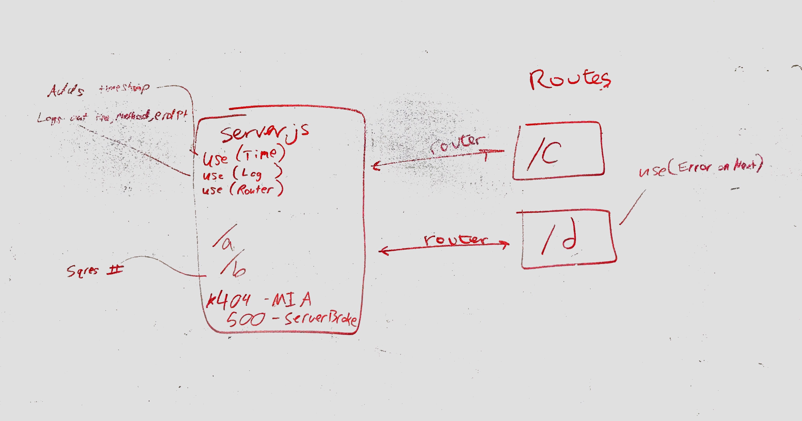

# LAB - 07

## middleware

### Author: Brad Smialek

Middleware, Routing, Modularization Practice

### Links and Resources

* [Link to lab-7-api-server](https://github.com/brad-smialek-401-advanced-javascript/lab-07-api-server/blob/master/README.md)
* [submission PR](https://github.com/brad-smialek-401-advanced-javascript/lab-07-middleware)
* [front-end](localhost:8080)

### Modules
#### `routes.js`
#### `server.js`

### Setup
* `PORT` - 8080

#### Running the app
* `nodemon` in terminal
* `http://localhost:8080/?route` in browser

* Endpoint: `/a`
  * res.status(200).send('Route A');
* Endpoint: `/b`
  * res.status(200).send(`Route B, numbers = ${req.number} `);
* Endpoint: `/c`
  * res.status(200).send('Route A');
* Endpoint: `/d`
  * res.status(200).send(`Route B, numbers = ${req.number} `);

  
#### Tests
* jest
* npm test routes.test.js

* What assertions were made?

* What assertions need to be / should be made?

#### UML

